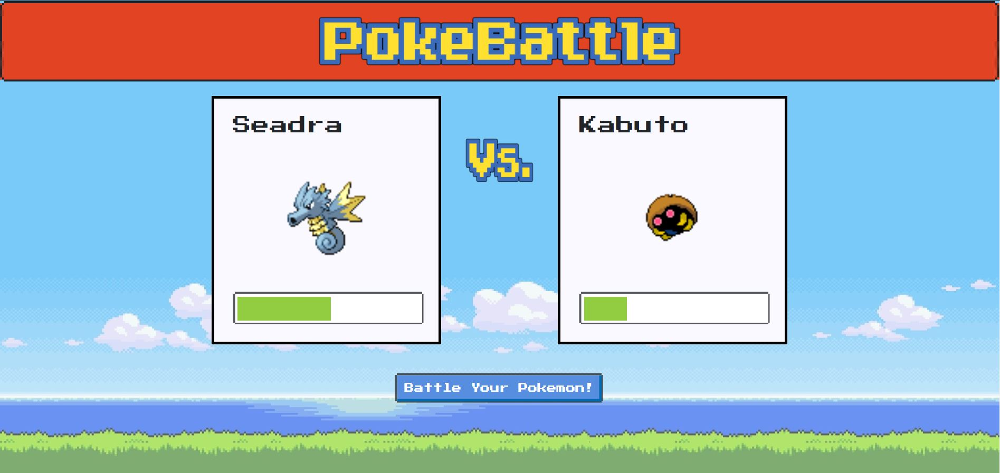

# PokéBattle ⚔️ 

Welcome all trainers! Have you ever had a dispute between friends end in disaster? From calling 'shotgun' in the parking lot to the last slice of pizza, PokéBattle is for you! 

Our team built this project to bring friends together. With the help of [Pokémon API](https://pokeapi.co/), we created a modern-day Pokémon equivalent to the coin toss. After reviewing the rules, users can start battle. Both trainers enter their username and generate a Pokémon. The battle button will quickly generate a winner and display the number of wins. 


# Deployed Application

Try it out!

[PokéBattle](https://pokemonbattles-app.herokuapp.com/)

## User Story

> As a USER, I want to quickly settle a dispute using pokemon to battle anf resolve a conflict.

# Acceptance Criteria

```
GIVEN I want a pokemon to battle
WHEN I enter the arena
THEN I will be generated a pokemon

GIVEN I want to settle an argument quickly
WHEN I battle my generated pokemon with my opponent's pokemon
THEN I will be given the results of who wins

```

# Technologies
- Express
- Foundation.css
- Handlebars
- HTML & CSS
- JavaScript
- jQuery
- MySQL
- Nes.css
- Node.js
- NPM:
  - @handlebars/allow-prototype-access
  - eslint
  - express
  - express-handlebars
  - mysql
  - nes.css
  - sequelize
  - typewriter-effect
- Travis CI

# Preview

> 

> 

> 

> 


# Contributors

<a href="https://github.com/bkim377">
         
      </a>

<a href="https://github.com/Eshi44">
         
      </a>

<a href="https://github.com/drivelikejehu">
         
      </a>

<a href="https://github.com/D3viii">
         
      </a>
